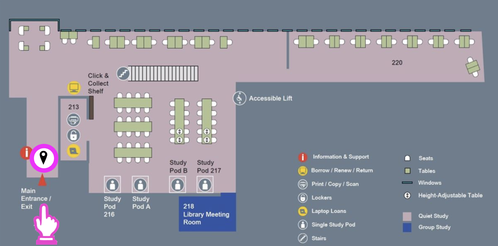
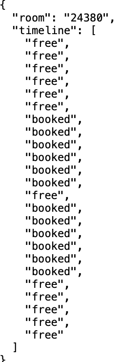
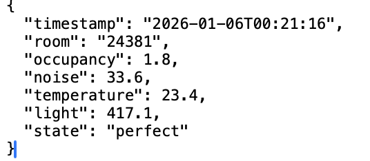
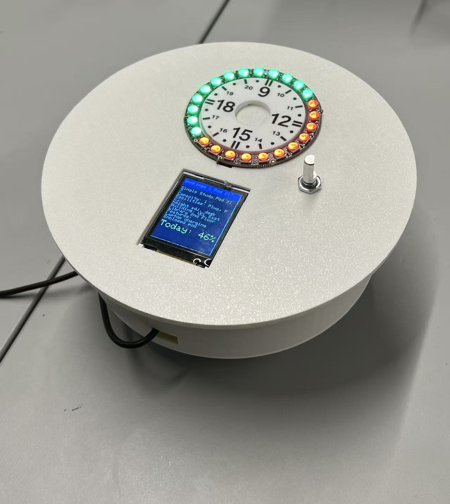

# Study Space Availability and Comfort Monitoring  
**CASA0019 – Sensor Data Visualisation**  
UCL Centre for Advanced Spatial Analysis

---

## 1. Introduction & Rationalization

Bookable study spaces play an important role in shaping how students focus, interact, and work together. These spaces support individual concentration as well as group discussion and collaborative learning, meaning that their availability and atmosphere directly influence both personal productivity and collective engagement.

At UCL, a web-based reservation system allows students to check the availability of study spaces in advance. While effective for scheduling, this system represents space primarily through box-style time slots and simplified visual layouts. Such representations provide limited insight into the spatial, social, and experiential qualities of learning environments. As a result, students often still need to physically visit a space to assess whether it supports their current mode of work. At an operational level, the same representation also makes it difficult to quickly perceive how spaces respond to changing occupancy patterns and room conditions throughout the day.

This project does not aim to replace the existing system, but to reinterpret its data through visualisation. It investigates how study space availability and room dynamics can be communicated through a combination of physical data visualisation and a digital twin, enabling information to be perceived passively rather than actively interpreted. By expressing data through physical form and visual behaviour, the project frames visualisation as a process of sense-making rather than optimisation. This approach supports everyday student decision-making while also offering facilities teams a higher-level understanding of how learning spaces perform over time.

*Figure 1. Bookable Study Space in UCL East Library (Study Pod & Meeting Room)*

---

## 2. From Data to Visual Language

The aim of this project is not to present raw metrics, but to translate key spatial conditions into a visual language that can be perceived intuitively. The system combines two types of data: availability information derived from the UCL Library Reservation booking API, and a set of simulated environmental and behavioural indicators designed to explore how the atmosphere of learning spaces might be communicated visually rather than numerically.

Availability is taken from the booking API and converted into a 30-minute free/booked timeline for each study space across the day (09:00–21:00), updated at regular intervals. This representation supports quick comparison of when a space is likely to be usable, without requiring users to read or interpret detailed schedules or time-slot tables.

To represent comfort and room dynamics, the project focuses on four indicators: occupancy percentage, noise, lighting, and temperature. In the current prototype, these values are synthetically generated within plausible ranges and treated as relative perceptual signals rather than precise measurements. Occupancy percentage represents perceived crowding, while noise functions as a behavioural proxy that increases with occupancy and occasional disruption. Lighting and temperature represent environmental comfort conditions that shape how a space feels over time. The logic used to generate and update these indicators is implemented in a Python-based simulation module, which is publicly available as part of the project repository (see study_space_simulator.py).

These indicators are translated into a small set of consistent visual rules shared across the physical device and the digital twin. In Bookings mode, the NeoPixel ring operates as a 24-slot timeline, where green represents free, and red represents booked. In Condition mode, the ring shifts to an animated attribute display: the system cycles through occupancy, noise, temperature, and light every five seconds, where colour identifies the active attribute and the number of illuminated LEDs encodes its magnitude. Here, visual behaviour refers to the temporal logic of attribute rotation and progressive fill, allowing meaning to emerge through change over time rather than through labels or numerical values. By applying the same mapping logic across media, the project establishes a coherent visual language for understanding availability and room dynamics at a glance.

<table align="center">
  <tr>
    <td align="center">
      
    </td>
    <td align="center">
      
    </td>
  </tr>
  <tr>
    <td align="center">
      <em>Figure 2. Sample JSON Output of Availability Data</em>
    </td>
    <td align="center">
      <em>Figure 3. Sample JSON Output of Comfort Data</em>
    </td>
  </tr>
</table>

---

## 3. Physical Data Visualization Device

The physical data visualisation device is conceived as a passive, ambient interface that communicates the state of study spaces without requiring sustained attention or analytical interaction. Rather than functioning as a dashboard that users must actively query, the device remains present in the environment and supports quick, intuitive readings through form, colour, and movement. This approach is suited to everyday study decisions, where users often need to assess space suitability rapidly rather than interpret detailed data.

  

<em>Figure 4. Final Physical Device Enclosure</em>

The device adopts a tabletop form factor with a circular geometry, inspired by the metaphor of a round conference table commonly associated with collaborative learning environments. The enclosure and structural components were designed using Fusion 360 and fabricated through 3D printing, allowing the physical form to align closely with the system’s data logic and interaction design. The device presents one study space at a time, with users navigating between spaces by rotating a rotary encoder and switching between modes by pressing the encoder. This simple, embodied interaction model reduces visual clutter and supports calm, sequential exploration rather than parallel comparison.

A NeoPixel LED ring serves as the primary medium for expressing temporal and quantitative information. In Bookings mode, the ring represents the full day from 09:00 to 21:00, with 24 LEDs corresponding to 30-minute intervals. Availability is communicated using a minimal categorical colour scheme—green for free and red for booked—allowing usable time periods to be recognised immediately without text or numerical interpretation. To support temporal orientation, the ring is paired with a circular acrylic overlay, engraved and manually sharpened using marker to resemble the markings of a watch face. This physical reference anchors the abstract LED timeline in a familiar time-reading convention.

In Condition mode, the LED ring shifts from a static timeline to an animated display of room dynamics. The system cycles through occupancy, noise, temperature, and lighting at fixed intervals. In this mode, colour identifies the active attribute, while the number of illuminated LEDs encodes its relative magnitude, scaled to the full ring. Progressive filling and timed rotation introduce motion as a key expressive element, allowing users to perceive intensity and change through visual behaviour rather than explicit values.

The TFT screen plays a complementary role across both modes. In Bookings mode, it provides contextual information such as room name, capacity, facilities, and the overall booking percentage for the day. In Condition mode, the screen intentionally avoids numerical data and instead presents an expressive icon summarising the room’s state, reinforcing perceptual understanding while preventing information overload.

Crucially, the device is designed to be readable without instruction. Colour, spatial position, repetition, movement, and simple physical gestures guide interpretation naturally. By embedding data within physical form and visual behaviour, the device transforms abstract spatial information into an intuitive, ambient presence that supports everyday decision-making in learning environments.

  

<em>Figure 5. Wiring Diagram</em>

---

## 4. Digital Visualization and Digital Twin

The digital twin extends the physical data visualisation device into a complementary digital medium, not to replace it, but to support different forms of interpretation and use. While the physical device is designed for peripheral, glance-based awareness in real space, the digital twin enables closer inspection and comparative understanding without altering the underlying data or logic of the system.

A screen shot of a device

Description automatically generated

Both the physical device and the digital twin subscribe to the same MQTT topics and operate on identical data streams. This ensures full consistency across media: colour mappings, modes, and temporal behaviours are preserved rather than reinterpreted. Availability is visualised using the same red–green logic, while environmental conditions are represented through the same four attributes—occupancy, noise, temperature, and light—each mapped to a consistent colour identity. The digital twin therefore functions as a direct extension of the physical language, rather than a separate interface.

The key enrichment provided by the digital twin lies in how information is spatially and temporally presented. Unlike the physical NeoPixel ring, which cycles through environmental attributes sequentially to preserve visual simplicity, the digital twin presents all four indicators simultaneously using concentric rings. This allows users to read multiple conditions in parallel and understand their relationships without waiting for temporal transitions. Quantitative values and units are also displayed, supporting verification and interpretation when more precision is required.

Importantly, the digital twin introduces persistence. Environmental states remain visible until updated, enabling users to pause, compare, and reflect—activities that are deliberately unsupported by the physical device, where meaning emerges through motion and change. This distinction reflects different interaction intentions rather than a hierarchy of interfaces.

Switching between physical and digital media typically occurs when a user moves from ambient awareness to focused inquiry. A student might first notice availability or atmosphere via the tabletop device, then consult the digital twin to understand why a space appears busy, noisy, or uncomfortable. The digital twin thus supports continuity of understanding across contexts.

For this reason, the digital twin is not “just a dashboard.” It does not introduce rankings, recommendations, or analytical layers. Instead, it preserves the same visual grammar while extending legibility, persistence, and simultaneity—allowing the same data to be read differently without changing its meaning.

---

## 5. Physical-Digital Integration

A core design principle of this project is the maintenance of a consistent visual language across physical and digital representations. Rather than treating the physical device and digital twin as separate interfaces, both are designed as parallel expressions of the same underlying data grammar. This ensures that meaning is preserved when users move between media, supporting recognition rather than reinterpretation.

At the level of encoding, both systems share the same visual rules. Colour is used categorically to distinguish attributes such as occupancy, noise, temperature, and lighting, while quantity (number of illuminated LEDs or radial fill extent) represents intensity. Temporal behaviour—such as gradual filling, pulsing, or rhythmic transitions—is used to communicate change over time. These mappings are applied consistently in both the NeoPixel-based physical device and the Unity digital twin, ensuring that data is transformed once conceptually, rather than re-encoded differently for each interface.

This consistency enables cognitive continuity across media. Users who understand the physical display can immediately interpret the digital twin without additional instruction, and vice versa. Because visual mappings remain stable, attention can shift from decoding symbols to interpreting spatial conditions and making decisions. This is particularly important in fast, low-stakes interactions such as choosing a study space, where cognitive load should be minimised.

Crucially, the project defines a visual grammar rather than a set of interface components. While the physical device prioritises ambient, glanceable perception and the digital twin provides expanded context and persistence, both adhere to the same visual language. This shared grammar allows each medium to play a complementary role without fragmenting the user’s understanding of the system.

**INSERT IMAGE TFT WITH EMOTICON**

---

## 6. Development Process & Visual Iteration

The project evolved through iterative testing of how much information could be communicated visually without overwhelming the user. An early proposal to display all five study spaces simultaneously using multiple NeoPixel rings was abandoned after prototyping revealed both physical complexity (wiring, power management) and cognitive overload. Instead, the interaction was refocused on a single space at a time, navigated via a rotary encoder, prioritising clarity and interpretability.

A key visual iteration concerned how room conditions were summarised. Rather than introducing additional numerical readouts or text, the system adopts expressive emoticons to represent overall room state. This approach was chosen to encourage emotional and intuitive interpretation—allowing users to sense whether a space “feels” calm, busy, or uncomfortable at a glance—without requiring analytical reading.

Another challenge involved representing multiple comfort attributes with different units and scales. Early ideas to place all scales directly on the device were rejected, as this quickly crowded the surface and conflicted with the ambient nature of the display. Instead, scale definitions and mappings were externalised into an online guideline booklet, maintaining visual simplicity on the device itself. While alternative solutions—such as printing legends directly onto the device—were considered, a fully satisfactory integration was not finalised within the project timeframe.

Material choices were also iterated. Although a wooden or laser-cut tabletop form was initially envisioned, time constraints led to a 3D-printed enclosure, refined through technical guidance to improve legibility and tactility. Together, these iterations reflect a balance between expressiveness, legibility, and practical stability.

---

## 7. Evaluation: Readability & Perception

The effectiveness of the system was evaluated qualitatively through readability, perceptual clarity, and interpretability rather than formal usability testing. As the device is designed for ambient awareness rather than precise measurement, success was assessed by how quickly users could form an understanding of space availability and comfort conditions at a glance.

The NeoPixel ring proved highly legible for temporal availability. The circular layout aligns naturally with a time-based mental model, allowing users to distinguish booked and free slots without textual explanation. Colour contrast between booked and free states enabled rapid pattern recognition, particularly when viewed from a distance. The physical rotation offset, mirrored in the digital twin, helped reinforce spatial orientation and reduced ambiguity.

For environmental conditions, readability was evaluated through perceptual differentiation rather than numerical accuracy. Progressive illumination and colour shifts allowed users to compare relative comfort levels without requiring interpretation of exact values. The use of emotive symbols further supported immediate comprehension by translating complex sensor data into affective cues.

The digital twin played a critical evaluative role by revealing limitations not visible in the physical artefact alone. On-screen overlays and zoomed perspectives exposed moments where colour similarity or animation speed reduced clarity, informing subsequent adjustments to thresholds and transitions.

Overall, the system prioritises perceptual coherence over analytical precision. Its success lies in enabling users to quickly judge whether a space is suitable rather than why in numerical terms, supporting lightweight decision-making in everyday contexts.

---

## 8. Reflection & Future Visual Extensions

This project highlights how quickly visual richness can become cognitive complexity. Although the system was deliberately limited to five study spaces and two primary modes, the combined use of colour, motion, and spatial encoding still requires an initial period of interpretation. For first-time users, the NeoPixel rings communicate presence and intensity effectively, but the absence of an embedded legend means that understanding relies on inference rather than immediate clarity. While this aligns with the goal of ambient, non-intrusive visualisation, it also reveals a tension between expressiveness and accessibility.

Another reflection concerns visual comfort. The NeoPixel LEDs provide strong contrast and visibility, but in a quiet study context their brightness can feel sharp, particularly in low-light environments. Although brightness was technically controllable, more work is needed to soften the visual output through diffusion, lower baseline intensity, or slower temporal transitions so the device feels more atmospheric and less attention-demanding.

A key future extension is to move beyond observing availability toward enabling booking directly through the system. This would transform the device from a passive visualisation into an actionable interface while preserving its ambient character.

### Extending Bookings mode to support selection

In addition to displaying availability, the rotary encoder could be used to step through individual 30-minute slots around the ring. A temporary visual behaviour (e.g. pulsing or rotating highlight) would indicate the currently selected time window without adding new colours or symbols.

### Expressing booking intent through MQTT

When a user confirms a selection via a long press, the device would publish a lightweight booking intent message containing sxthe room ID and time range. This keeps the physical interaction simple while making the action explicit within the system.

### Validation through a service layer

A backend service would listen for booking intents and re-check live availability through the booking API. This ensures that the physical device does not act on outdated information.

### Completing booking through official channels

Rather than handling authentication on the device, the service would redirect users to the existing booking workflow with the selected room and time pre-filled. This preserves institutional access control while still grounding the interaction in the physical artefact.

### Immediate visual feedback

Confirmation or rejection would be sent back to both the physical device and the digital twin, using brief, distinct animations rather than text-heavy messages to maintain visual continuity.

Alongside functional expansion, future iterations would also focus on reducing perceptual load: softer LED output, more gradual animations, and clearer onboarding through subtle, built-in guidance rather than external documentation. These changes would strengthen the device’s role as a calm, intelligible interface embedded within everyday study environments.

---

## 9. Individual Contributions

This project was completed by the team members working together. Gilang Pamungkas is responsible for the development of the program code and communication implementation of the physical device; Yuqian Lin is responsible for the digital twin and AR visualization on the Unity platform; Chaoshuo Han is responsible for the structural Design and 3D modeling of the physical device. Cheng Zhong was in charge of cross-module collaboration and integration, and was involved in the implementation of digital twin related aspects as well as the overall structure planning of the report. The report was jointly written and modified by all the members of the team to ensure consistency between the system and the report.
