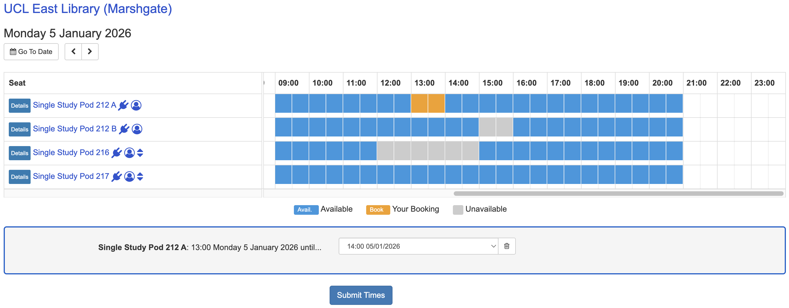
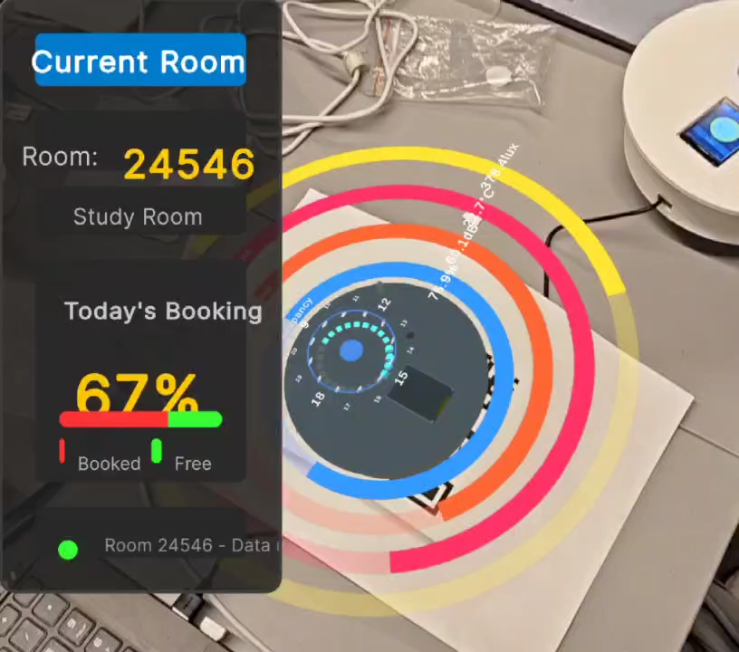
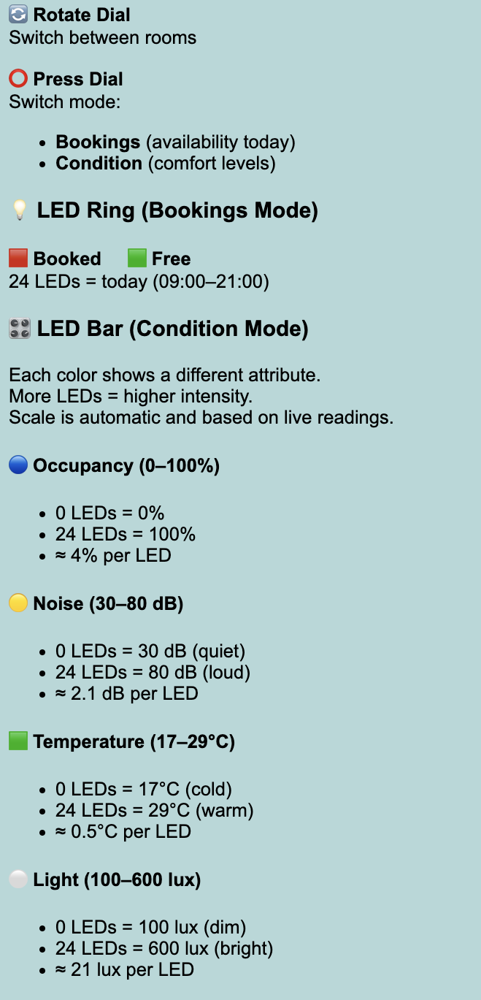
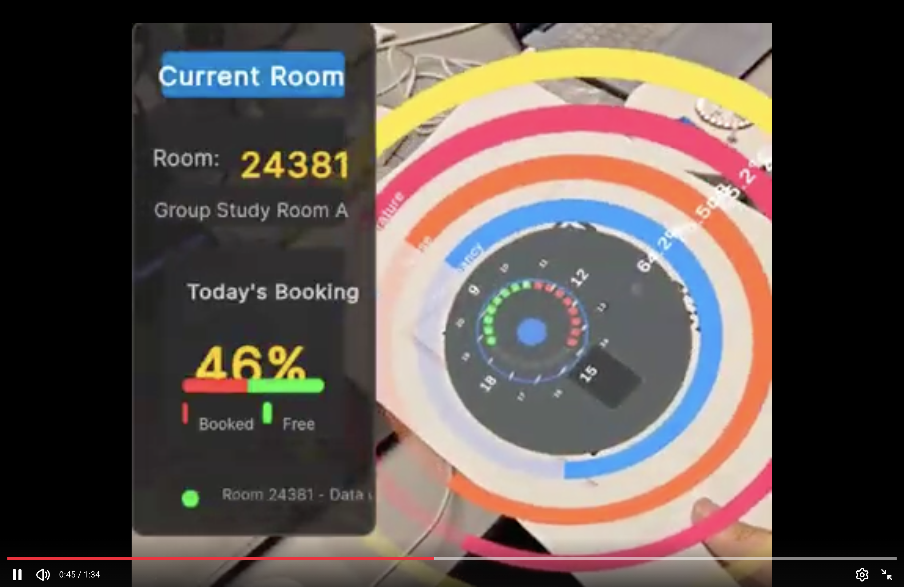

# Study Space Availability and Comfort Monitoring  
**CASA0019 – Sensor Data Visualisation**  
UCL Centre for Advanced Spatial Analysis

---

## 1. Introduction & Rationalization

Bookable study spaces play an important role in shaping how students focus, interact, and work together. Their availability and atmosphere directly influence both individual productivity and collaborative learning.

At UCL, a web-based reservation system allows students to check the availability of study spaces in advance. While effective for scheduling, this system represents space primarily through box-style time slots and simplified visual layouts. Such representations provide limited insight into the experiential qualities of learning environments. As a result, students often still need to physically visit a space to assess whether it supports their current mode of work. At an operational level, the same representation also makes it difficult to quickly perceive how spaces respond to changing occupancy patterns and room conditions throughout the day.

This project does not aim to replace the existing system, but to reinterpret its data through visualisation. It investigates how study space availability and room dynamics can be communicated through a combination of physical data visualisation and a digital twin, enabling information to be perceived passively rather than actively interpreted. By expressing data through physical form and visual behaviour, the project frames visualisation as a process of sense-making. This approach supports everyday student decision-making while also offering facilities teams a higher-level understanding of how learning spaces perform over time.

  

<em>Figure 1. Existing Bookable Study Space System</em>

---

## 2. From Data to Visual Language

The project translates key spatial conditions into a visual language that can be perceived intuitively. The system combines two types of data: availability information derived from the UCL Library Reservation booking API, and a set of simulated environmental and behavioural indicators designed to explore how the atmosphere of learning spaces might be communicated visually rather than numerically.

Availability is taken from the booking API and converted into a 30-minute free/booked timeline for each study space across the day (09:00–21:00), updated at regular intervals. This representation supports quick comparison of when a space is likely to be usable, without requiring users to read or interpret detailed schedules or time-slot tables.

To represent comfort and room dynamics, the project focuses on four indicators: occupancy percentage, noise, lighting, and temperature. In the current prototype, these values are synthetically generated within plausible ranges and treated as relative perceptual signals rather than precise measurements. The logic used to generate and update these indicators is implemented in a Python-based simulation module, which is publicly available as part of the project repository (see study_space_simulator.py).

<table align="center">
  <tr>
    <td align="center">
      
    </td>
    <td align="center">
      
    </td>
  </tr>
  <tr>
    <td align="center">
      <em>Figure 2. Sample JSON Output of Availability Data</em>
    </td>
    <td align="center">
      <em>Figure 3. Sample JSON Output of Comfort Data</em>
    </td>
  </tr>
</table>

---

## 3. Physical Data Visualization Device

The physical data visualisation device is conceived as a passive, ambient interface that communicates the state of study spaces at a glance. Rather than functioning as an interactive dashboard, the device supports quick, intuitive interpretation through form, colour, and movement, aligning with everyday study decisions that require rapid assessment rather than detailed analysis.

  

<em>Figure 4. Final Physical Device Enclosure</em>

The device adopts a tabletop form factor with a circular geometry, inspired by the metaphor of a round conference table associated with collaborative learning. The enclosure was designed in Fusion 360 and fabricated through 3D printing, aligning the physical form with the system’s data logic and interaction model. One study space is presented at a time, with navigation handled via a rotary encoder for switching spaces and modes, supporting calm, sequential exploration.

A NeoPixel LED ring serves as the primary medium for temporal and quantitative representation. In Bookings mode, the ring maps the day from 09:00 to 21:00 using 24 LEDs to represent 30-minute intervals, with green indicating availability and red indicating bookings. A circular acrylic overlay, engraved to resemble a watch face, provides a familiar temporal reference for the abstract LED timeline.

In Condition mode, the ring transitions to an animated display of room dynamics, cycling through occupancy, noise, temperature, and lighting. Colour identifies the active attribute, while the number of illuminated LEDs encodes relative magnitude. Progressive filling and rotation communicate intensity and change over time through visual behaviour.

The TFT screen complements the LED ring by providing contextual information. In Bookings mode, it displays room details and overall booking levels, while in Condition mode it presents expressive icons rather than numerical values to reinforce perceptual understanding and reduce cognitive load.

Overall, the device is designed to be readable without instruction. By embedding data within physical form and visual behaviour, it translates abstract spatial information into an intuitive, ambient presence that supports everyday decision-making in learning environments.

  

<em>Figure 5. Wiring Diagram</em>

---

## 4. Digital Visualization and Digital Twin

The digital twin extends the physical data visualisation device into a complementary digital medium that supports different forms of interpretation. While the physical device is designed for peripheral, glance-based awareness in real space, the digital twin enables closer inspection and comparison without altering the underlying data or system logic.

  

<em>Figure 6. Final Digital Twin</em>

Both the physical device and the digital twin subscribe to the same MQTT topics and operate on identical data streams, ensuring consistency across media. Colour mappings, modes, and temporal behaviours are preserved, with availability represented through the same red–green logic and environmental conditions expressed using four shared attributes: occupancy, noise, temperature, and lighting. The digital twin therefore functions as a direct extension of the physical visual language.

The primary enrichment offered by the digital twin lies in its spatial and temporal presentation. Unlike the physical NeoPixel ring, which cycles through attributes sequentially to maintain visual simplicity, the digital twin presents all four indicators simultaneously using concentric rings. This allows conditions to be read in parallel and compared directly. Quantitative values and units are also displayed to support verification when greater precision is required.

The digital twin additionally introduces persistence. Environmental states remain visible until updated, enabling pausing, comparison, and reflection—activities that are intentionally unsupported by the physical device, where meaning emerges through motion and change. Users typically transition to the digital twin when moving from ambient awareness to focused inquiry, for example to understand why a space appears busy, noisy, or uncomfortable.

Rather than functioning as a conventional dashboard, the digital twin preserves the same visual grammar as the physical device while extending legibility, persistence, and simultaneity. This allows the same data to be interpreted differently across media without changing its underlying meaning.

---

## 5. Physical-Digital Integration

A core design principle of this project is the maintenance of a shared visual language across physical and digital representations. Rather than functioning as separate interfaces, the physical device and digital twin operate as parallel expressions of the same underlying data mappings, ensuring that meaning is preserved as users move between media.

Both systems apply identical visual rules: colour distinguishes attributes such as occupancy, noise, temperature, and lighting, while quantity and radial extent represent relative intensity. Temporal behaviours, including gradual filling and rhythmic transitions, are used consistently to communicate change over time. By transforming data once conceptually and applying it across media, the system supports continuity of interpretation while allowing each interface to emphasise its respective strengths—ambient awareness in the physical device and persistence and comparison in the digital twin.

---

## 6. Development Process & Visual Iteration

The project evolved through iterative testing of how much information could be communicated visually without overwhelming the user. An early proposal to display all five study spaces simultaneously using multiple NeoPixel rings was abandoned after prototyping revealed both physical complexity (wiring, power management) and cognitive overload. Instead, the interaction was refocused on a single space at a time, navigated via a rotary encoder, prioritising clarity and interpretability.

A key visual iteration concerned how room conditions were summarised. Rather than introducing additional numerical readouts or text, the system adopts expressive emoticons to represent overall room state. This approach was chosen to encourage emotional and intuitive interpretation—allowing users to sense whether a space “feels” calm, busy, or uncomfortable at a glance—without requiring analytical reading.

Another challenge involved representing multiple comfort attributes with different units and scales. Early ideas to place all scales directly on the device were rejected, as this quickly crowded the surface and conflicted with the ambient nature of the display. Instead, scale definitions and mappings were externalised into an online guideline booklet, maintaining visual simplicity on the device itself. While alternative solutions—such as printing legends directly onto the device—were considered, a fully satisfactory integration was not finalised within the project timeframe.

  

<em>Figure 7. Scale Description on Online Guideline Booklet</em>

Material choices were also iterated. Although a wooden or laser-cut tabletop form was initially envisioned, time constraints led to a 3D-printed enclosure, refined through technical guidance to improve legibility and tactility. Together, these iterations reflect a balance between expressiveness, legibility, and practical stability.

---

## 7. Evaluation: Readability & Perception

The NeoPixel ring proved highly legible for temporal availability. The circular layout aligns naturally with a time-based mental model, allowing users to distinguish booked and free slots without textual explanation. Colour contrast between booked and free states enabled rapid pattern recognition, particularly when viewed from a distance. The physical rotation offset, mirrored in the digital twin, helped reinforce spatial orientation and reduced ambiguity.

For environmental conditions, readability was evaluated through perceptual differentiation rather than numerical accuracy. Progressive illumination and colour shifts allowed users to compare relative comfort levels without requiring interpretation of exact values. The use of emotive symbols further supported immediate comprehension by translating complex sensor data into affective cues.

The digital twin played a critical evaluative role by revealing limitations not visible in the physical artefact alone. On-screen overlays and zoomed perspectives exposed moments where colour similarity or animation speed reduced clarity, informing subsequent adjustments to thresholds and transitions.

Overall, the system prioritises perceptual coherence over analytical precision. Its success lies in enabling users to quickly judge whether a space is suitable rather than why in numerical terms, supporting lightweight decision-making in everyday contexts.

🚀 See the project come to life! Watch the demo on Youtube here: 

*Figure 8. Video demonstrating two different modes on the physical device and its digital twin*

---

## 8. Reflection & Future Visual Extensions

This project highlights how quickly visual richness can become cognitive complexity. Although the system was deliberately limited to five study spaces and two primary modes, the combined use of colour, motion, and spatial encoding still requires an initial period of interpretation. For first-time users, the NeoPixel rings communicate presence and intensity effectively, but the absence of an embedded legend means that understanding relies on inference rather than immediate clarity. While this aligns with the goal of ambient, non-intrusive visualisation, it also reveals a tension between expressiveness and accessibility.

Another reflection concerns visual comfort. The NeoPixel LEDs provide strong contrast and visibility, but in a quiet study context their brightness can feel sharp, particularly in low-light environments. Although brightness was controllable, future work could soften the visual output through diffusion or slower temporal transitions.

A key future extension is to move beyond observing availability toward enabling booking directly through the system. This would transform the device from a passive visualisation into an actionable interface while preserving its ambient character.

*Figure 9. Bookable Study Space in UCL East Library (Study Pod & Meeting Room)*

The following outlines the proposed step-by-step workflow:

1. **Extending Bookings mode to support selection** 
   The rotary encoder is used to step through individual 30-minute time slots around the LED ring, with a temporary visual highlight indicating the current selection.

2. **Expressing booking intent through MQTT** 
   A long press publishes a booking intent message containing the selected room ID and time range.

3. **Validation through a service layer** 
   A backend service receives the booking intent and verifies availability against the live booking API.

4. **Completing booking through official channels** 
   Users are redirected to the existing booking system with the selected room and time pre-filled.

5. **Immediate visual feedback** 
   Confirmation or rejection is reflected on both the physical device and the digital twin through brief visual animations.

Alongside functional expansion, future iterations would also focus on reducing perceptual load: softer LED output, more gradual animations, and clearer onboarding through subtle, built-in guidance rather than external documentation. These changes would strengthen the device’s role as a calm, intelligible interface embedded within everyday study environments.

---

## 9. Individual Contributions

This project was developed collaboratively. Gilang Pamungkas led the system concept, interaction design, and physical device software; Yuqian Lin developed the digital twin and AR visualisation; Chaoshuo Han designed and modelled the physical enclosure; Cheng Zhong coordinated integration and report structure. The report was jointly written by all team members.